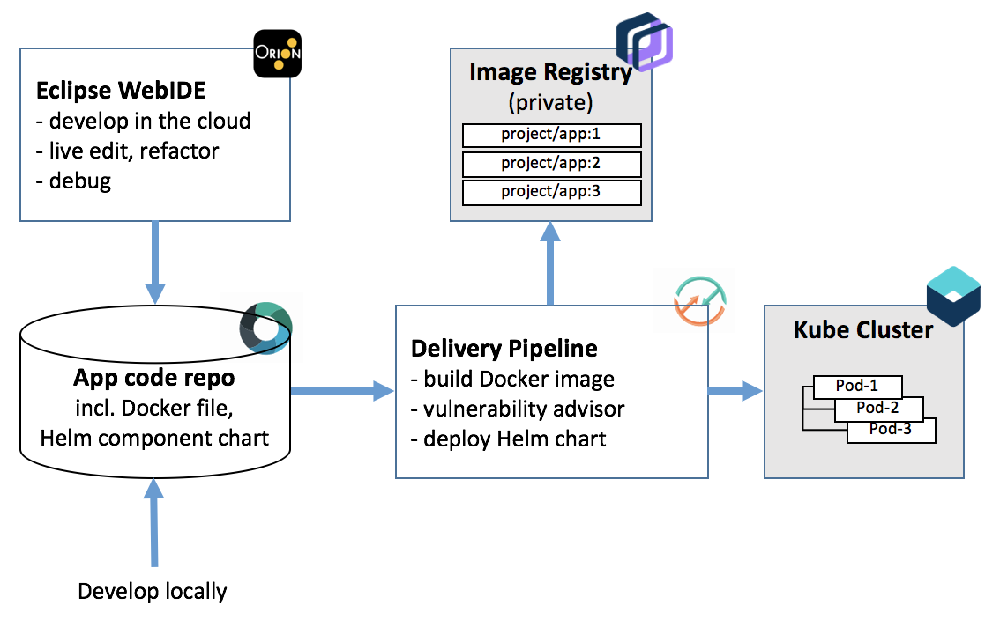

#  Develop a Kubernetes app with Helm

### Continuously deliver a secure Docker app to a Kubernetes Cluster using a Helm Chart
This Hello World application uses Docker, Kubernetes and Helm in a DevOps toolchain preconfigured for 
continuous delivery to the IBM Kubernetes Service. It automates numerous tasks such automatic triggering from Git
commits, issue tracking, online editing, automatic linting of files, configuration of target cluster permissions to private image registry, etc... through a preconfigured Delivery Pipeline.

### To get started, click this button:

### Use it with your own application:
This template assumes an application (e.g. [hello-helm](https://github.com/open-toolchain/hello-helm)) structured like this  :
- `/Dockerfile` [configurable] -- the docker file used to build the container image in root folder (can be configured in pipeline BUILD stage properties)
- `/chart /your-app-name`  [configurable] -- the Helm Chart used to deploy this application. The CI pipeline automatically binding it with build information (e.g. image tag) leveraging Helm ability to parameterize deployment actions. (can be configured in pipeline PROD deploy stage properties)

It implements the following best practices:
- sanity check the Dockerfile prior to attempting creating the image,
- build container image on every Git commit,
- use a private image registry to store the built image, automatically configure access permissions for target cluster deployment using API tokens than can be revoked,
- check container image for security vulnerabilities,
- use a Helm chart to conduct the deployment of each release, abstracting away continuous integration via Helm command parameters,
- use an explicit namespace in cluster to insulate each deployment (and make it easy to clear, by "kubectl delete namespace"),
- reuse existing Tiller (Helm server) if detected, install it if missing (allowing to control Helm version via env property in pipeline)

---
### Learn more 

* Blog [Continuously deliver your app to Kubernetes with IBM Cloud](https://admin.blogs.prd.ibm.event.ibm.com/blogs/bluemix/?p=114624&preview=1&_ppp=ac27c51c93)
* [Step-by-step tutorial](https://www.ibm.com/cloud/garage/tutorials/tc-simple-kube-helm)
* [Getting started with IBM Cloud clusters](https://cloud.ibm.com/docs/containers/container_index.html?pos=2)
* [Getting started](https://cloud.ibm.com/devops/getting-started) with toolchains
* [Documentation](https://cloud.ibm.com/docs/services/ContinuousDelivery/index.html?pos=2)
* Helm chart development [tips and tricks](https://kubernetes.io/docs/tasks/configure-pod-container/pull-image-private-registry/)
* Helm Classic [Guide](https://kubernetes.io/docs/concepts/containers/images/#using-a-private-registry)
