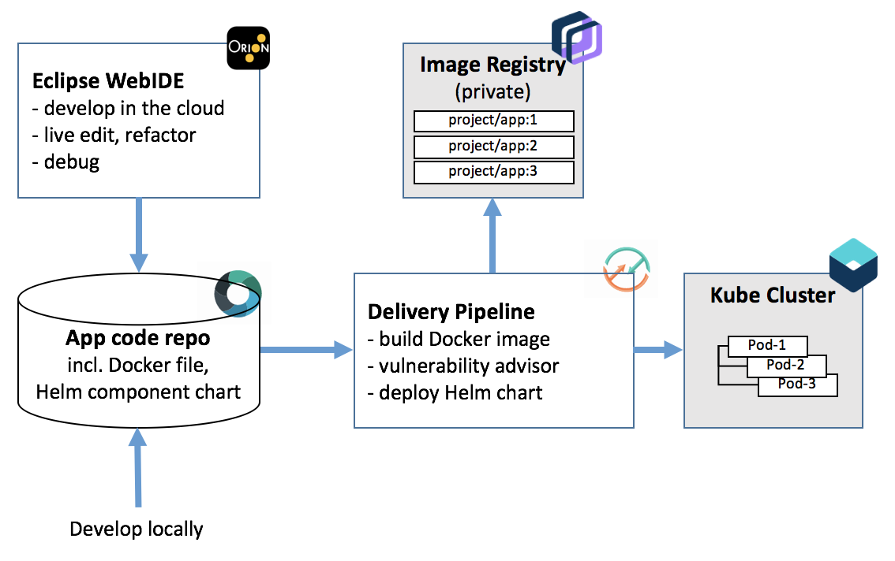
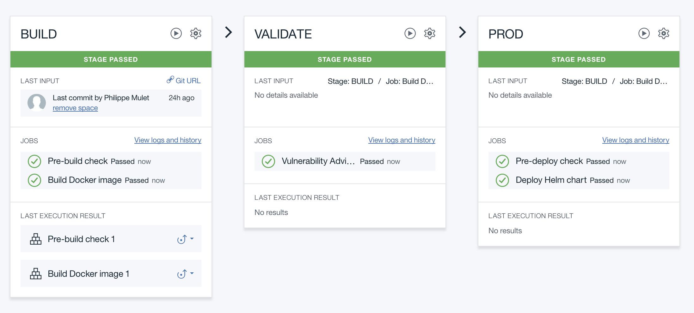

#  Develop a Kubernetes app with Helm 3

### Continuously deliver a secure Docker app to a Kubernetes Cluster using a Helm Chart
This Hello World application uses Docker, Kubernetes and Helm in a DevOps toolchain preconfigured for 
continuous delivery to the IBM Kubernetes Service. It automates numerous tasks such automatic triggering from Git
commits, issue tracking, online editing, automatic linting of files, configuration of target cluster permissions to private image registry, etc... through a preconfigured Delivery Pipeline.

### To get started, click this button:

### Use it with your own application:
This template assumes an application (e.g. [hello-helm](https://github.com/open-toolchain/hello-helm)) structured like this  :
- `/Dockerfile` [configurable] -- the docker file used to build the container image in root folder (can be configured in pipeline BUILD stage properties)
- `/chart /your-app-name`  [configurable] -- the Helm Chart used to deploy this application. The CI pipeline automatically binding it with build information (e.g. image tag) leveraging Helm ability to parameterize deployment actions. (can be configured in pipeline PROD deploy stage properties)

It implements the following best practices:
- sanity check the Dockerfile prior to attempting creating the image,
- build container image on every Git commit,
- use a private image registry to store the built image, automatically configure access permissions for target cluster deployment using API tokens than can be revoked,
- check container image for security vulnerabilities,
- use a Helm chart to conduct the deployment of each release, abstracting away continuous integration via Helm command parameters. Reuse existing Tiller (Helm server) if detected, install it if missing (allowing to control Helm version via env property in pipeline)
- use an explicit namespace in cluster to insulate each deployment (and make it easy to clear, by "kubectl delete namespace"),

### Detailed Description - Tekton Pipelines

This pipeline and relevant trigger(s) can be configured using the properties described below.

See https://cloud.ibm.com/docs/ContinuousDelivery?topic=ContinuousDelivery-tekton-pipelines&interface=ui#configure_tekton_pipeline for more information.

**EventListeners:**

- [manual-run](#manual-run) - manual run listener
- [github-ent-commit](#github-ent-commit) - github enterprise commit push event listener
- [github-commit](#github-commit) - github commit push event listener
- [grit-or-gitlab-commit](#grit-or-gitlab-commit) - GRIT/gitlab commit push event listener
- [bitbucket-commit](#bitbucket-commit) - bitbucket commit push event listener
- [github-pr-listener](#github-pr-listener) - github pull-request listener
- [gitlab-pr-listener](#gitlab-pr-listener) - GRIT/gitlab merge-request listener

#### manual-run

**EventListener**: manual-run - manual run listener

| Properties | Description | Default | Required | Type |
|------------|-------------|---------|----------|------|
| `apikey` (**secured property**) | [IBM Cloud Api Key](https://cloud.ibm.com/iam/apikeys) used to access to the toolchain (and git intergation toolcard like `Git Repos and Issue Tracking` service if used). | - | Yes | secret |
| `app-name` | application name | - | Yes | string |
| `branch` | the branch for the git repo | `master` | No | string |
| `build-script` | The command(s) to run the build in run-build step. It will override the default commands | `` | No | string |
| `cluster-name` | the name of the cluster to target | - | Yes | string |
| `commons-hosted-region` | the url to retrieve the commons script repository content | `https://raw.githubusercontent.com/open-toolchain/commons/master` | No | string |
| `custom-image-registry-dockerconfigjson` | dockerconfigjson for custom images used in pipeline tasks. See https://cloud.ibm.com/docs/devsecops?topic=devsecops-troubleshoot-devsecops#troubleshoot-pipe-abort-early | `eyJhdXRocyI6e319` | No | string |
| `dev-cluster-namespace` | namespace to perform the deployment on the cluster | - | Yes | string |
| `dev-region` | The region that hosts the cluster. | - | Yes | string |
| `dev-resource-group` | The resource group that the cluster is attached to. | - | Yes | string |
| `dockerfile` | The name of the Dockerfile to use for building the image | `Dockerfile` | No | string |
| `fail-on-lint-errors` | force failure of task when docker lint errors are found | `true` | No | string |
| `fail-on-scanned-issues` | force failure of task when vulnerability advisor scan issues are found | `true` | No | string |
| `git-token` | access token for the git repo | `` | No | string |
| `helm-chart-path` | path to the folder containing the helm chart content (at least Chart.yaml). If not specified, it will default to first folder in /chart | `` | No | string |
| `helm-upgrade-extra-args` | complementary argument for the helm upgrade command | `` | No | string |
| `ibmcloud-api` | the ibmcloud api | `https://cloud.ibm.com` | No | string |
| `image-name` | image name | - | Yes | string |
| `path-to-context` | the path to the context that is used for the build (`.` meaning current directory) | `.` | No | string |
| `path-to-dockerfile` | the path to the Dockerfile that is used for the build (`.` meaning current directory) | `.` | No | string |
| `pipeline-debug` | Pipeline debug mode. Value can be 0 or 1. | `0` | No | string |
| `registry-create-namespace` | create container registry namespace if it doesn't already exists | `true` | No | string |
| `registry-namespace` | container registry namespace | - | Yes | string |
| `registry-region` | The IBM Cloud region for image registry | - | Yes | string |
| `repository` | the git repo containing source code. If empty, the repository url will be found from toolchain | `` | No | string |
| `revision` | the git revision/commit for the git repo | `` | No | string |
| `tester-tests-image` | Image to use for `unit-test` task | `icr.io/continuous-delivery/pipeline/pipeline-base-ubi:3.79` | No | string |
| `toolchain-apikey` (**secured property**) | the api key used to access toolchain and DOI instance | - | Yes | secret |
| `toolchain-build-image` | Image to use for `build` task | `icr.io/continuous-delivery/pipeline/pipeline-base-ubi:3.79` | No | string |

#### github-ent-commit

**EventListener**: github-ent-commit - github enterprise commit push event listener

| Properties | Description | Default | Required | Type |
|------------|-------------|---------|----------|------|
| `apikey` (**secured property**) | [IBM Cloud Api Key](https://cloud.ibm.com/iam/apikeys) used to access to the toolchain (and git intergation toolcard like `Git Repos and Issue Tracking` service if used). | - | Yes | secret |
| `app-name` | application name | - | Yes | string |
| `branch` | the branch for the git repo | `$(event.ref)` | No | string |
| `build-script` | The command(s) to run the build in run-build step. It will override the default commands | `` | No | string |
| `cluster-name` | the name of the cluster to target | - | Yes | string |
| `commit-id` | - | `$(event.after)` | No | string |
| `commit-timestamp` | - | `$(event.repository.pushed_at)` | No | string |
| `commons-hosted-region` | the url to retrieve the commons script repository content | `https://raw.githubusercontent.com/open-toolchain/commons/master` | No | string |
| `custom-image-registry-dockerconfigjson` | dockerconfigjson for custom images used in pipeline tasks. See https://cloud.ibm.com/docs/devsecops?topic=devsecops-troubleshoot-devsecops#troubleshoot-pipe-abort-early | `eyJhdXRocyI6e319` | No | string |
| `dev-cluster-namespace` | namespace to perform the deployment on the cluster | - | Yes | string |
| `dev-region` | The region that hosts the cluster. | - | Yes | string |
| `dev-resource-group` | The resource group that the cluster is attached to. | - | Yes | string |
| `dockerfile` | The name of the Dockerfile to use for building the image | `Dockerfile` | No | string |
| `fail-on-lint-errors` | force failure of task when docker lint errors are found | `true` | No | string |
| `fail-on-scanned-issues` | force failure of task when vulnerability advisor scan issues are found | `true` | No | string |
| `git-token` | access token for the git repo | `` | No | string |
| `helm-chart-path` | path to the folder containing the helm chart content (at least Chart.yaml). If not specified, it will default to first folder in /chart | `` | No | string |
| `helm-upgrade-extra-args` | complementary argument for the helm upgrade command | `` | No | string |
| `ibmcloud-api` | the ibmcloud api | `https://cloud.ibm.com` | No | string |
| `image-name` | image name | - | Yes | string |
| `path-to-context` | the path to the context that is used for the build (`.` meaning current directory) | `.` | No | string |
| `path-to-dockerfile` | the path to the Dockerfile that is used for the build (`.` meaning current directory) | `.` | No | string |
| `pipeline-debug` | Pipeline debug mode. Value can be 0 or 1. | `0` | No | string |
| `registry-create-namespace` | create container registry namespace if it doesn't already exists | `true` | No | string |
| `registry-namespace` | container registry namespace | - | Yes | string |
| `registry-region` | The IBM Cloud region for image registry | - | Yes | string |
| `repository` | the git repo containing source code. If empty, the repository url will be found from toolchain | `$(event.repository.html_url)` | No | string |
| `revision` | the git revision/commit for the git repo | `` | No | string |
| `scm-type` | - | `github-ent` | No | string |
| `tester-tests-image` | Image to use for `unit-test` task | `icr.io/continuous-delivery/pipeline/pipeline-base-ubi:3.79` | No | string |
| `toolchain-apikey` (**secured property**) | the api key used to access toolchain and DOI instance | - | Yes | secret |
| `toolchain-build-image` | Image to use for `build` task | `icr.io/continuous-delivery/pipeline/pipeline-base-ubi:3.79` | No | string |

#### github-commit

**EventListener**: github-commit - github commit push event listener

| Properties | Description | Default | Required | Type |
|------------|-------------|---------|----------|------|
| `apikey` (**secured property**) | [IBM Cloud Api Key](https://cloud.ibm.com/iam/apikeys) used to access to the toolchain (and git intergation toolcard like `Git Repos and Issue Tracking` service if used). | - | Yes | secret |
| `app-name` | application name | - | Yes | string |
| `branch` | the branch for the git repo | `$(event.ref)` | No | string |
| `build-script` | The command(s) to run the build in run-build step. It will override the default commands | `` | No | string |
| `cluster-name` | the name of the cluster to target | - | Yes | string |
| `commit-id` | - | `$(event.after)` | No | string |
| `commit-timestamp` | - | `$(event.repository.updated_at)` | No | string |
| `commons-hosted-region` | the url to retrieve the commons script repository content | `https://raw.githubusercontent.com/open-toolchain/commons/master` | No | string |
| `custom-image-registry-dockerconfigjson` | dockerconfigjson for custom images used in pipeline tasks. See https://cloud.ibm.com/docs/devsecops?topic=devsecops-troubleshoot-devsecops#troubleshoot-pipe-abort-early | `eyJhdXRocyI6e319` | No | string |
| `dev-cluster-namespace` | namespace to perform the deployment on the cluster | - | Yes | string |
| `dev-region` | The region that hosts the cluster. | - | Yes | string |
| `dev-resource-group` | The resource group that the cluster is attached to. | - | Yes | string |
| `dockerfile` | The name of the Dockerfile to use for building the image | `Dockerfile` | No | string |
| `fail-on-lint-errors` | force failure of task when docker lint errors are found | `true` | No | string |
| `fail-on-scanned-issues` | force failure of task when vulnerability advisor scan issues are found | `true` | No | string |
| `git-token` | access token for the git repo | `` | No | string |
| `helm-chart-path` | path to the folder containing the helm chart content (at least Chart.yaml). If not specified, it will default to first folder in /chart | `` | No | string |
| `helm-upgrade-extra-args` | complementary argument for the helm upgrade command | `` | No | string |
| `ibmcloud-api` | the ibmcloud api | `https://cloud.ibm.com` | No | string |
| `image-name` | image name | - | Yes | string |
| `path-to-context` | the path to the context that is used for the build (`.` meaning current directory) | `.` | No | string |
| `path-to-dockerfile` | the path to the Dockerfile that is used for the build (`.` meaning current directory) | `.` | No | string |
| `pipeline-debug` | Pipeline debug mode. Value can be 0 or 1. | `0` | No | string |
| `registry-create-namespace` | create container registry namespace if it doesn't already exists | `true` | No | string |
| `registry-namespace` | container registry namespace | - | Yes | string |
| `registry-region` | The IBM Cloud region for image registry | - | Yes | string |
| `repository` | the git repo containing source code. If empty, the repository url will be found from toolchain | `$(event.repository.html_url)` | No | string |
| `revision` | the git revision/commit for the git repo | `` | No | string |
| `scm-type` | - | `github` | No | string |
| `tester-tests-image` | Image to use for `unit-test` task | `icr.io/continuous-delivery/pipeline/pipeline-base-ubi:3.79` | No | string |
| `toolchain-apikey` (**secured property**) | the api key used to access toolchain and DOI instance | - | Yes | secret |
| `toolchain-build-image` | Image to use for `build` task | `icr.io/continuous-delivery/pipeline/pipeline-base-ubi:3.79` | No | string |

#### grit-or-gitlab-commit

**EventListener**: grit-or-gitlab-commit - GRIT/gitlab commit push event listener

| Properties | Description | Default | Required | Type |
|------------|-------------|---------|----------|------|
| `apikey` (**secured property**) | [IBM Cloud Api Key](https://cloud.ibm.com/iam/apikeys) used to access to the toolchain (and git intergation toolcard like `Git Repos and Issue Tracking` service if used). | - | Yes | secret |
| `app-name` | application name | - | Yes | string |
| `branch` | the branch for the git repo | `$(event.ref)` | No | string |
| `build-script` | The command(s) to run the build in run-build step. It will override the default commands | `` | No | string |
| `cluster-name` | the name of the cluster to target | - | Yes | string |
| `commit-id` | - | `$(event.checkout_sha)` | No | string |
| `commit-timestamp` | - | `$(event.commits[0].timestamp)` | No | string |
| `commons-hosted-region` | the url to retrieve the commons script repository content | `https://raw.githubusercontent.com/open-toolchain/commons/master` | No | string |
| `custom-image-registry-dockerconfigjson` | dockerconfigjson for custom images used in pipeline tasks. See https://cloud.ibm.com/docs/devsecops?topic=devsecops-troubleshoot-devsecops#troubleshoot-pipe-abort-early | `eyJhdXRocyI6e319` | No | string |
| `dev-cluster-namespace` | namespace to perform the deployment on the cluster | - | Yes | string |
| `dev-region` | The region that hosts the cluster. | - | Yes | string |
| `dev-resource-group` | The resource group that the cluster is attached to. | - | Yes | string |
| `dockerfile` | The name of the Dockerfile to use for building the image | `Dockerfile` | No | string |
| `fail-on-lint-errors` | force failure of task when docker lint errors are found | `true` | No | string |
| `fail-on-scanned-issues` | force failure of task when vulnerability advisor scan issues are found | `true` | No | string |
| `git-token` | access token for the git repo | `` | No | string |
| `helm-chart-path` | path to the folder containing the helm chart content (at least Chart.yaml). If not specified, it will default to first folder in /chart | `` | No | string |
| `helm-upgrade-extra-args` | complementary argument for the helm upgrade command | `` | No | string |
| `ibmcloud-api` | the ibmcloud api | `https://cloud.ibm.com` | No | string |
| `image-name` | image name | - | Yes | string |
| `path-to-context` | the path to the context that is used for the build (`.` meaning current directory) | `.` | No | string |
| `path-to-dockerfile` | the path to the Dockerfile that is used for the build (`.` meaning current directory) | `.` | No | string |
| `pipeline-debug` | Pipeline debug mode. Value can be 0 or 1. | `0` | No | string |
| `registry-create-namespace` | create container registry namespace if it doesn't already exists | `true` | No | string |
| `registry-namespace` | container registry namespace | - | Yes | string |
| `registry-region` | The IBM Cloud region for image registry | - | Yes | string |
| `repository` | the git repo containing source code. If empty, the repository url will be found from toolchain | `$(event.project.http_url)` | No | string |
| `revision` | the git revision/commit for the git repo | `` | No | string |
| `scm-type` | - | `gitlab` | No | string |
| `tester-tests-image` | Image to use for `unit-test` task | `icr.io/continuous-delivery/pipeline/pipeline-base-ubi:3.79` | No | string |
| `toolchain-apikey` (**secured property**) | the api key used to access toolchain and DOI instance | - | Yes | secret |
| `toolchain-build-image` | Image to use for `build` task | `icr.io/continuous-delivery/pipeline/pipeline-base-ubi:3.79` | No | string |

#### bitbucket-commit

**EventListener**: bitbucket-commit - bitbucket commit push event listener

| Properties | Description | Default | Required | Type |
|------------|-------------|---------|----------|------|
| `apikey` (**secured property**) | [IBM Cloud Api Key](https://cloud.ibm.com/iam/apikeys) used to access to the toolchain (and git intergation toolcard like `Git Repos and Issue Tracking` service if used). | - | Yes | secret |
| `app-name` | application name | - | Yes | string |
| `branch` | the branch for the git repo | `$(event.push.changes[0].new.name)` | No | string |
| `build-script` | The command(s) to run the build in run-build step. It will override the default commands | `` | No | string |
| `cluster-name` | the name of the cluster to target | - | Yes | string |
| `commit-id` | - | `$(event.pull_request.head.sha)` | No | string |
| `commit-timestamp` | - | `$(event.pull_request.head.repo.pushed_at)` | No | string |
| `commons-hosted-region` | the url to retrieve the commons script repository content | `https://raw.githubusercontent.com/open-toolchain/commons/master` | No | string |
| `custom-image-registry-dockerconfigjson` | dockerconfigjson for custom images used in pipeline tasks. See https://cloud.ibm.com/docs/devsecops?topic=devsecops-troubleshoot-devsecops#troubleshoot-pipe-abort-early | `eyJhdXRocyI6e319` | No | string |
| `dev-cluster-namespace` | namespace to perform the deployment on the cluster | - | Yes | string |
| `dev-region` | The region that hosts the cluster. | - | Yes | string |
| `dev-resource-group` | The resource group that the cluster is attached to. | - | Yes | string |
| `dockerfile` | The name of the Dockerfile to use for building the image | `Dockerfile` | No | string |
| `fail-on-lint-errors` | force failure of task when docker lint errors are found | `true` | No | string |
| `fail-on-scanned-issues` | force failure of task when vulnerability advisor scan issues are found | `true` | No | string |
| `git-token` | access token for the git repo | `` | No | string |
| `helm-chart-path` | path to the folder containing the helm chart content (at least Chart.yaml). If not specified, it will default to first folder in /chart | `` | No | string |
| `helm-upgrade-extra-args` | complementary argument for the helm upgrade command | `` | No | string |
| `ibmcloud-api` | the ibmcloud api | `https://cloud.ibm.com` | No | string |
| `image-name` | image name | - | Yes | string |
| `path-to-context` | the path to the context that is used for the build (`.` meaning current directory) | `.` | No | string |
| `path-to-dockerfile` | the path to the Dockerfile that is used for the build (`.` meaning current directory) | `.` | No | string |
| `pipeline-debug` | Pipeline debug mode. Value can be 0 or 1. | `0` | No | string |
| `registry-create-namespace` | create container registry namespace if it doesn't already exists | `true` | No | string |
| `registry-namespace` | container registry namespace | - | Yes | string |
| `registry-region` | The IBM Cloud region for image registry | - | Yes | string |
| `repository` | the git repo containing source code. If empty, the repository url will be found from toolchain | `$(event.repository.links.html.href)` | No | string |
| `revision` | the git revision/commit for the git repo | `$(event.push.changes[0].new.target.hash)` | No | string |
| `scm-type` | - | `bitbucket` | No | string |
| `tester-tests-image` | Image to use for `unit-test` task | `icr.io/continuous-delivery/pipeline/pipeline-base-ubi:3.79` | No | string |
| `toolchain-apikey` (**secured property**) | the api key used to access toolchain and DOI instance | - | Yes | secret |
| `toolchain-build-image` | Image to use for `build` task | `icr.io/continuous-delivery/pipeline/pipeline-base-ubi:3.79` | No | string |

#### github-pr-listener

**EventListener**: github-pr-listener - github pull-request listener

| Properties | Description | Default | Required | Type |
|------------|-------------|---------|----------|------|
| `apikey` (**secured property**) | [IBM Cloud Api Key](https://cloud.ibm.com/iam/apikeys) used to access to the toolchain (and git intergation toolcard like `Git Repos and Issue Tracking` service if used). | - | Yes | secret |
| `branch` | The git branch | `$(event.pull_request.base.ref)` | No | string |
| `build-script` | The command(s) to run the build in run-build step. It will override the default commands | `` | No | string |
| `commit-id` | commit id | `$(event.after)` | No | string |
| `custom-image-registry-dockerconfigjson` | dockerconfigjson for custom images used in pipeline tasks. See https://cloud.ibm.com/docs/devsecops?topic=devsecops-troubleshoot-devsecops#troubleshoot-pipe-abort-early | `eyJhdXRocyI6e319` | No | string |
| `git-token` | access token for the git repo | `` | No | string |
| `ibmcloud-api` | The ibmcloud api | `https://cloud.ibm.com` | No | string |
| `pipeline-debug` | Pipeline debug mode. Value can be 0 or 1. | `0` | No | string |
| `pr-branch` | The branch in the forked git repo from where the PR is made | `$(event.pull_request.head.ref)` | No | string |
| `pr-repository` | The forked git repo from where the PR is made | `$(event.pull_request.head.repo.html_url)` | No | string |
| `repository` | The git repo | `$(event.repository.html_url)` | No | string |
| `tester-tests-image` | Image to use for `unit-test` task | `icr.io/continuous-delivery/pipeline/pipeline-base-ubi:3.79` | No | string |
| `toolchain-build-image` | Image to use for `build` task | `icr.io/continuous-delivery/pipeline/pipeline-base-ubi:3.79` | No | string |

#### gitlab-pr-listener

**EventListener**: gitlab-pr-listener - GRIT/gitlab merge-request listener

| Properties | Description | Default | Required | Type |
|------------|-------------|---------|----------|------|
| `apikey` (**secured property**) | [IBM Cloud Api Key](https://cloud.ibm.com/iam/apikeys) used to access to the toolchain (and git intergation toolcard like `Git Repos and Issue Tracking` service if used). | - | Yes | secret |
| `branch` | The git branch | `$(event.object_attributes.target_branch)` | No | string |
| `build-script` | The command(s) to run the build in run-build step. It will override the default commands | `` | No | string |
| `commit-id` | commit id | `$(event.object_attributes.last_commit.id)` | No | string |
| `custom-image-registry-dockerconfigjson` | dockerconfigjson for custom images used in pipeline tasks. See https://cloud.ibm.com/docs/devsecops?topic=devsecops-troubleshoot-devsecops#troubleshoot-pipe-abort-early | `eyJhdXRocyI6e319` | No | string |
| `git-token` | access token for the git repo | `` | No | string |
| `ibmcloud-api` | The ibmcloud api | `https://cloud.ibm.com` | No | string |
| `pipeline-debug` | Pipeline debug mode. Value can be 0 or 1. | `0` | No | string |
| `pr-branch` | The branch in the forked git repo from where the PR is made | `$(event.object_attributes.source_branch)` | No | string |
| `pr-repository` | The forked git repo from where the PR is made | `$(event.object_attributes.source.http_url)` | No | string |
| `repository` | The git repo | `$(event.project.http_url)` | No | string |
| `tester-tests-image` | Image to use for `unit-test` task | `icr.io/continuous-delivery/pipeline/pipeline-base-ubi:3.79` | No | string |
| `toolchain-build-image` | Image to use for `build` task | `icr.io/continuous-delivery/pipeline/pipeline-base-ubi:3.79` | No | string |

### Learn more 

* [Step-by-step tutorial](https://www.ibm.com/cloud/architecture/tutorials/use-develop-kubernetes-app-with-helm-toolchain)
* [Getting started with IBM Cloud clusters](https://cloud.ibm.com/docs/containers/container_index.html?pos=2)
* [Getting started](https://cloud.ibm.com/devops/getting-started) with toolchains
* [Documentation](https://cloud.ibm.com/docs/services/ContinuousDelivery/index.html?pos=2)
* Helm chart development [tips and tricks](https://kubernetes.io/docs/tasks/configure-pod-container/pull-image-private-registry/)
* Helm Classic [Guide](https://kubernetes.io/docs/concepts/containers/images/#using-a-private-registry)
